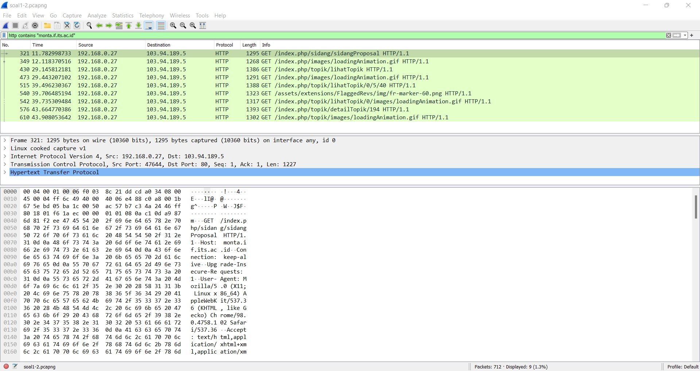
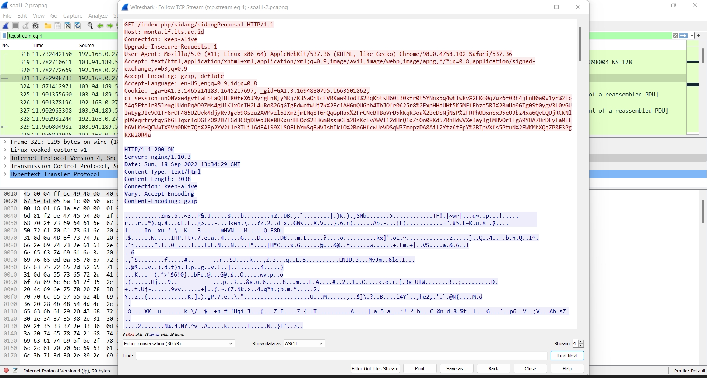
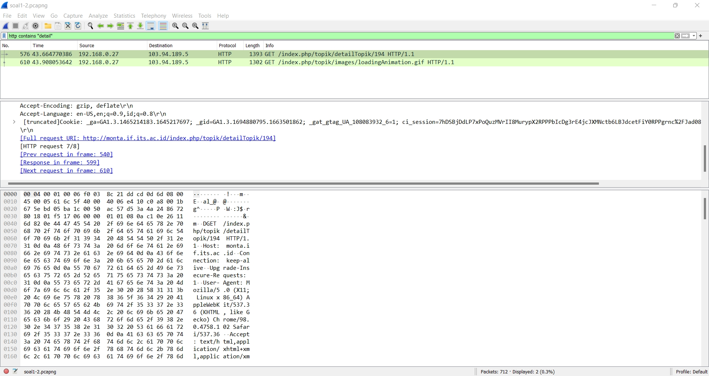
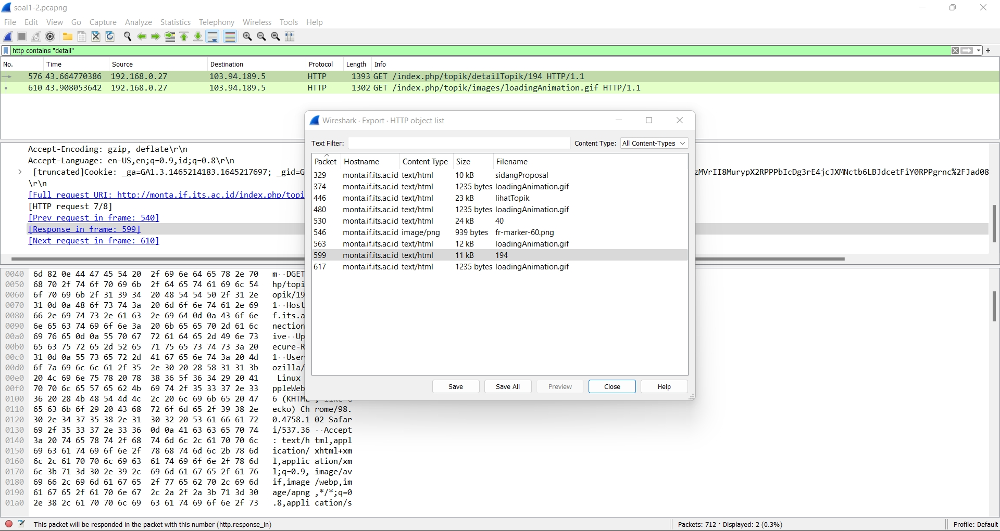
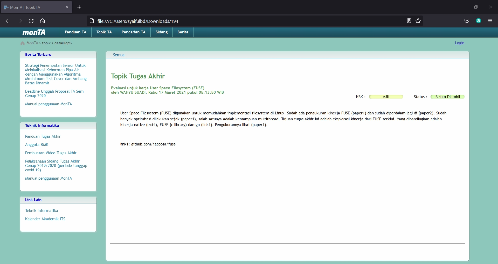

# Jarkom-Modul-1-E03-2022

## Kelompok E03
- Pedro T. Korwa              05111940007003
- Made Rianja Richo Dainino   5025201236
- Syaiful Bahri Dirgantara    5025201203

### 1. Sebutkan web server yang digunakan pada "monta.if.its.ac.id"! 
Jawaban : NGINX
- Memfilter pencarian “monta.if.its.ac.id”

- Klik kanan pada salah satu paket kemudian, klik follow TCP stream, maka akan muncul seperti gambar di bawah yang menginformasikan bahwa web servernya merupakan NGINX

### 2. Ishaq sedang bingung mencari topik ta untuk semester ini , lalu ia datang ke website monta dan menemukan detail topik pada website “monta.if.its.ac.id” , judul TA apa yang dibuka oleh ishaq ?
Jawaban : Evaluasi unjuk kerja User Space Filesystem (FUSE)
- Filter http request yang berisi “detail”

- Terlihat selanjutnya setelah detail topik adalah lanjut ke halaman 194 (juga dari response in frame menuju paket 599), dimana ketika dilihat paket 599 berisi halaman 194 juga, dan ketika di export object halaman 194 berisi file txt/html, kemudian simpan file tersebut

- Kemudian buka file tersebut melalui browser maka akan terbuka halaman yang dibuka Ishaq yaitu berisi topik tugas akhir yang berjudul “Evaluasi unjuk kerja User Space Filesystem (FUSE)”

### 8. Telusuri aliran paket dalam file .pcap yang diberikan, cari informasi berguna berupa percakapan antara dua mahasiswa terkait tindakan kecurangan pada kegiatan praktikum. Percakapan tersebut dilaporkan menggunakan protokol jaringan dengan tingkat keandalan yang tinggi dalam pertukaran datanya sehingga kalian perlu menerapkan filter dengan protokol yang tersebut.
Jawaban : Diawali dengan membuka file soal8-10.pcapng, kemudian dikarenakan kita perlu memperhatikan protokol jaringan dengan tingkat keandalan yang tinggi dalam pertukaran datanya, kita dapat mengecek protokol TCP dengan melakukan display filter "tcp", kemudian kita dapat melihat streamnya dengan klik kanan salah satu paket TCP dan memilih opsi Follow>TCP Stream dan kita dapat menjelajah TCP Streamnya 1 per 1 hingga menemukan percakapan rahasia yang dimaksud. Saya juga memasukkan beberapa paket yang berisi informasi lain sebagai berikut. Kendala yang kami alami yakni sebelum revisi kami tidak melakukan display filter "tcp" sehingga tidak mengikuti suruhan soal dengan sesuai.  

### 9. Terdapat laporan adanya pertukaran file yang dilakukan oleh kedua mahasiswa dalam percakapan yang diperoleh, carilah file yang dimaksud! Untuk memudahkan laporan kepada atasan, beri nama file yang ditemukan dengan format [nama_kelompok].des3 dan simpan output file dengan nama “flag.txt”.
Jawaban : Dari stream salted yang kita temukan dari tahap sebelumnya, kita perlu mengubah data yang ditampilkan menjadi raw, yang mana kemudian data tersebut kita save menjadi c03.des3. Tahap selanjutnya kita dapat men-decrypt dengan openssl berdasarkan referensi dari laman [Encrypt & Decrypt Files from the Command Line with OpenSSL (osxdaily.com)](https://osxdaily.com/2012/01/30/encrypt-and-decrypt-files-with-openssl/), kemudian kita dapat memasukkan passwordnya yang mana berdasarkan percakapan rahasia kita dapatkan clue “kesamaan dari karakter anime kembar 5” dan didapatkan passwordnya adalah “nakano”. Kendala yang kami alami selama pengerjaan yakni ketika menemukan salt, kami mencoba-coba dari langsung copas saltnya, yang mana mengakibatkan kami mencoba bermacam jenis password berdasarkan clue tersebut.  

### 10.	Temukan password rahasia (flag) dari organisasi bawah tanah yang disebutkan di atas!
Jawaban : Dan dengan begitu kita mendapatkan file yang ter-decrypt di dalam file flag.txt yakni flagnya adalah JaRkOm2022{8uK4N_CtF_k0k_h3h3h3}  

